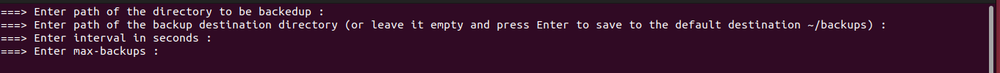

# Backup Script

## Made by:

- Ahmad Said Nouh
  - ID: 7086

## Contents:

- [Backup Script](#backup-script)
  - [Made by:](#made-by)
  - [Contents:](#contents)
  - [User Manual](#user-manual)
    - [Starting the program](#starting-the-program)
    - [Enter inputs](#enter-inputs)
    - [How to use](#how-to-use)
  - [Input Validations](#input-validation)

## User Manual

### Starting the program

First run {sudo apt install make} command if make is not installed on your machine. Then, open the {/main} directory in a terminal. Then just run {make} command. That's it...  

### Enter inputs

Once you run {make} command, the program will ask you to enter the four inputs as shown in the below image.
__Important note:__ all directories that will be dealed with must be below your home directory. Therefore, any directory name you will enter to the program must be relative to the (\~/). The tilde (\~) is a Linux "shortcut" to denote a user's home directory. Thus tilde slash (~/) is the beginning of a path to a file or directory below the user's home directory. For example, if you have a directory named __abc__ below your home directory then its path is __~/abc__. So if you want to back it up then just enter to the program __abc__, not __~/abc__.

- First input {dir}: it is the directory to be backed up, must be existing directory
- Second input {backupdir}: it is the backup destination directory, and has 6 cases:
  - cases1: default directory(~/cron-backups) and it's not exiting ==============> will create it then proceed directly. 
  - cases2: default directory(~/cron-backups) and it's exiting but empty ========> will proceed directly. 					
  - cases3: default directory(~/cron-backups) and it's exiting but not empty ====> will firstly ask the user if he want to delete all existing files in ~/cron-backups. 
  - cases4: user specified directory and it's not existing ======================> will create it then proceed directly. 	
  - cases5: user specified directory and it's existing but empty ================> will proceed directly. 						
  - cases6: user specified directory and it's existing but not empty ============> will display error message and then terminate execution without any deletion. 		

  

### How to use

